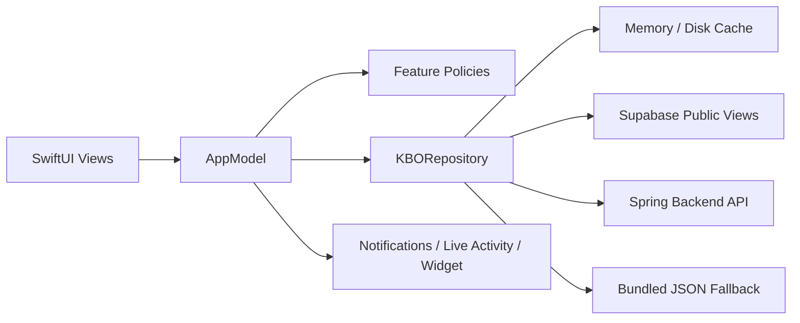
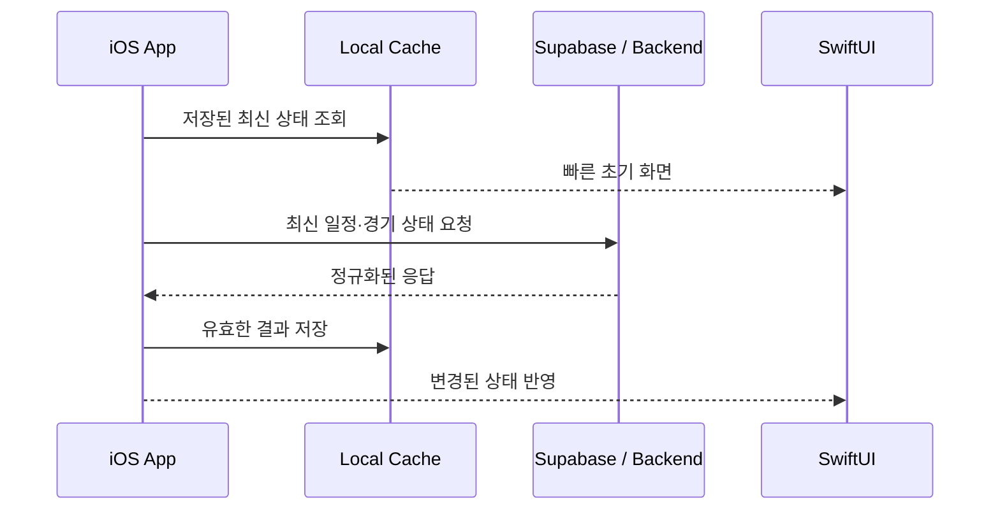

<p align="center">
  
</p>

<h1 align="center">kboScore</h1>

<p align="center">
  응원 팀의 경기 흐름을 가장 빠르게 확인하는 실시간 KBO 스코어 앱
</p>

<p align="center">
  
  
  
  
</p>

## 소개

`kboScore`는 오늘의 경기, 일정, 순위, 상세 기록을 한곳에서 확인하고 응원 팀의 주요 변화를 알림과 Live Activity로 받아볼 수 있는 iOS 앱입니다.

단순히 데이터를 표시하는 데서 그치지 않고, 네트워크 실패와 원천 데이터 누락에도 화면이 안정적으로 유지되도록 캐시와 번들 데이터를 활용합니다. 게임 상태와 사용자 설정은 하나의 앱 모델에서 관리하고, 화면에서 필요한 판단은 기능별 정책 객체로 분리해 테스트할 수 있도록 구성했습니다.

## 주요 기능

| 기능 | 설명 |
| --- | --- |
| 홈 | 응원 팀 중심으로 오늘의 경기 상태, 점수와 주요 정보를 표시합니다. |
| 경기 일정 | 월간·일간 일정과 경기 결과를 탐색하고 오래된 상태를 재확인합니다. |
| 경기 상세 | 이닝, 볼카운트, 주자, 라인업과 박스스코어를 제공합니다. |
| 팀 순위 | KBO 순위와 팀별 기록, 순위 변동을 비교합니다. |
| 직관 기록 | 관람한 경기를 기록하고 직관 통계를 확인합니다. |
| 알림 | 득점, 경기 시작·종료 등 선택한 이벤트를 푸시 알림으로 전달합니다. |
| Live Activity | 응원 팀 경기를 잠금 화면과 Dynamic Island에서 확인합니다. |
| 홈 화면 위젯 | 응원 팀의 가까운 경기 일정을 빠르게 보여줍니다. |
| 개인화 | 응원 팀, 알림 범위와 화면 스타일을 설정합니다. |

## 기술 스택

- **UI:** SwiftUI
- **상태 및 비동기 처리:** Observation, Swift Concurrency
- **데이터:** Supabase Swift, REST API, 번들 JSON, 디스크·메모리 캐시
- **시스템 연동:** ActivityKit, WidgetKit, UserNotifications, BackgroundTasks
- **테스트:** Swift Testing, XCTest UI Testing
- **배포 안전성:** xcconfig, 빌드 단계 검증, App Store 사전 점검 스크립트

외부 패키지는 `supabase-swift`만 직접 사용하며, 버전은 `Package.resolved`에 고정합니다.

## 아키텍처



### 설계 원칙

1. **화면과 데이터 소스 분리**  
   화면은 `KBORepository` 계약에만 의존하고, 실행 환경에 따라 Supabase·캐시·번들 저장소를 조합합니다.

2. **도메인 판단의 독립성**  
   경기 선택, 일정 병합, 순위 계산, Live Activity 노출 조건을 작은 정책 타입으로 분리합니다.

3. **불완전한 데이터 허용**  
   외부 응답의 누락 필드와 형식 차이는 DTO·매퍼·파서 계층에서 흡수하고, 화면에는 명시적인 로딩·오류·fallback 상태를 제공합니다.

4. **플랫폼 기능의 경계 유지**  
   푸시 등록, Live Activity와 위젯 동기화를 전용 서비스로 격리해 앱 상태 로직과 시스템 API를 구분합니다.

## 프로젝트 구조

```text
kboScore/
├── kboScore/                         # 메인 앱 타깃
│   ├── Data/                         # Repository, DTO, API, cache, parser
│   ├── Domain/                       # 도메인 모델, 식별자, 공통 정책
│   ├── Features/                     # 화면별 표시·계산·갱신 정책
│   ├── Models/                       # 앱 설정과 표시 모델
│   ├── Services/                     # 알림, 보안, Live Activity, 위젯
│   ├── State/                        # AppModel과 영속 상태
│   └── Views/                        # SwiftUI 화면과 공통 컴포넌트
├── kboScoreLiveActivityExtension/    # Live Activity·위젯 extension
├── kboScoreTests/                    # Swift Testing 단위·통합 테스트
├── kboScoreUITests/                  # XCTest UI 테스트
├── scripts/                          # 설정 검증과 릴리스 사전 점검
└── docs/                             # App Store·보안 운영 문서
```

## 실행 방법

### 요구 사항

- macOS와 Xcode
- iOS 26.2 이상을 실행할 수 있는 Simulator 또는 기기
- 푸시 알림과 Live Activity를 검증하려면 Apple Developer 서명 설정과 실제 기기 필요

### 1. 저장소 받기

```bash
git clone https://github.com/rudadlswh/ballCount.git
cd ballCount
open kboScore.xcodeproj
```

### 2. Debug 환경 설정

저장소의 Debug 기본값으로 앱을 실행할 수 있습니다. 다른 Supabase 또는 로컬 백엔드를 사용할 때만 로컬 설정 파일을 만듭니다.

```bash
cp kboScore/Config/Secrets.local.xcconfig.example \
   kboScore/Config/Secrets.local.xcconfig
```

`Secrets.local.xcconfig`에서 필요한 항목을 수정합니다.

```xcconfig
SUPABASE_URL = https:/$()/your-project.supabase.co
SUPABASE_PUBLISHABLE_KEY = your-publishable-key
SUPABASE_DB_SCHEMA = kbo_crawler_api_dev
KBO_ATTENDANCE_BACKEND_BASE_URL = http:/$()/192.168.0.10:8088
```

> `Secrets.local.xcconfig`는 Git에서 제외됩니다. 비밀키, 인증서와 APNs `.p8` 파일은 저장소에 추가하지 마세요.

### 3. 앱 실행

Xcode에서 `kboScore` scheme과 실행할 기기를 선택한 뒤 `⌘R`을 누릅니다.

CLI에서 빌드하려면 다음 명령을 사용할 수 있습니다.

```bash
xcodebuild \
  -project kboScore.xcodeproj \
  -scheme kboScore \
  -destination 'generic/platform=iOS Simulator' \
  build
```

## 테스트

핵심 도메인 정책, 외부 응답 매핑, 캐시, 일정 병합, 알림 등록, Live Activity와 위젯 상태를 Swift Testing으로 검증합니다. 현재 `kboScoreTests.swift`에는 **572개의 `@Test` 선언**이 있습니다.

```bash
xcodebuild \
  -project kboScore.xcodeproj \
  -scheme kboScore-UnitTests \
  -destination 'platform=iOS Simulator,name=iPhone 17' \
  test
```

설치된 Simulator 이름이 다르면 다음 명령으로 확인한 뒤 `-destination` 값을 변경합니다.

```bash
xcrun simctl list devices available
```

## 데이터 흐름



- 앱 시작 시 캐시와 번들 bootstrap을 활용해 빈 화면을 줄입니다.
- 네트워크 결과는 도메인 모델로 변환한 뒤 기존 경기와 병합합니다.
- 실시간 경기만 필요한 주기로 갱신하고, 백그라운드 동작은 iOS 실행 정책을 따릅니다.
- Release 빌드는 HTTPS 운영 백엔드와 production APNs 환경이 아니면 검증 단계에서 실패합니다.

## 릴리스

App Store 배포 전 운영 URL, 서명 인증서와 provisioning profile을 준비한 뒤 사전 점검 스크립트를 실행합니다.

```bash
KBO_PRODUCTION_BACKEND_BASE_URL=https://api.example.com \
KBO_APPSTORE_APP_PROVISIONING_PROFILE_SPECIFIER='App Profile' \
KBO_APPSTORE_EXTENSION_PROVISIONING_PROFILE_SPECIFIER='Extension Profile' \
scripts/app_store_release_preflight.sh
```

자세한 내용은 다음 문서를 참고하세요.

- [App Store 제출 체크리스트](docs/app-store-submission.md)
- [보안 운영 가이드](docs/security-operations.md)
- [백엔드 저장소](https://github.com/rudadlswh/ballCount_back)

